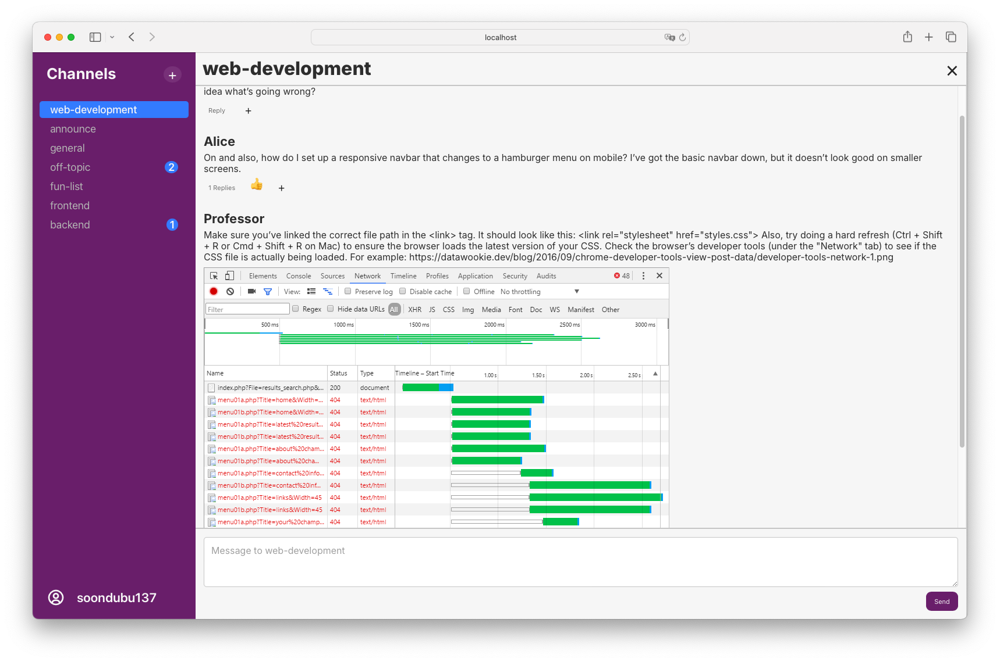
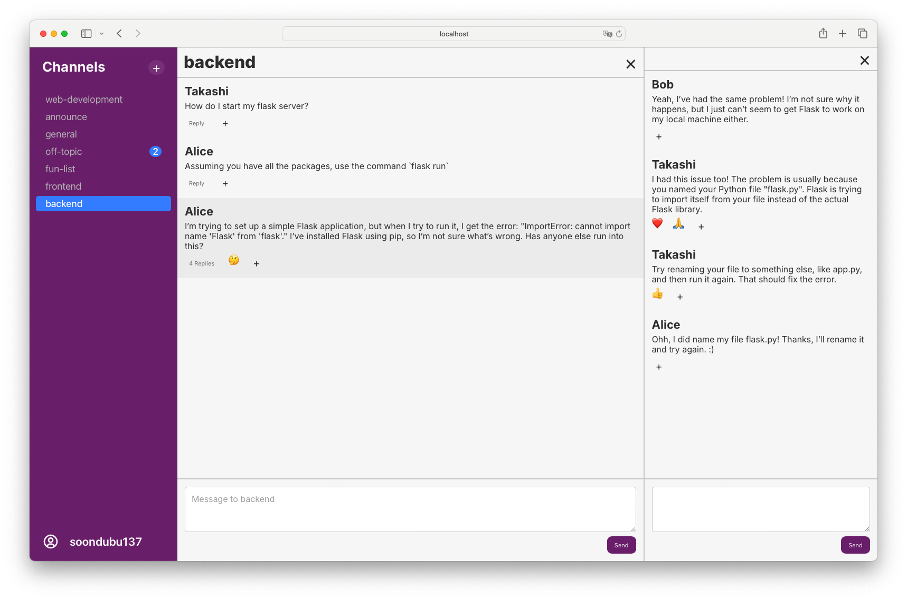

<Badge type="tip" text="python" />
<Badge type="tip" text="flask" />
<Badge type="tip" text="html-css-js" />
<Badge type="tip" text="react" />
<Badge type="tip" text="sqlite" />
<Badge type="tip" text="web-development" />
<Badge type="tip" text="full-stack" />
<Badge type="info" text="school-project" />

# Belay

Private source code.

::: warning CLARIFICATION
Source code for school projects cannot be public.
:::

## Introduction

Belay was the capstone project for my web development class at UChicago. It is a single-page application that sort of resemble Slack - a workspace messaging application. It features both a React-based frontend and a Flask-based repository-level backend (i.e. its primary function is to interact with the database), with sqlite as the data store. *I coded the entire project within a weekend, so there are many aspects that can be improved...*

## Gallery

## Technologies & Tools

- Frontend: HTML, CSS, and JavaScript (React).
- Backend: Python (Flask).
- Database: sqlite.

## Features

### Core Behavior

- Belay lets users send and read real-time chat messages that are organized into channels. Users see a list of all the channels on the server and can click one to enter that channel. Inside, they see all the messages posted to that channel by any user, and can post their own messages. All messages belong to a channel and all channels are visible to all users. For simplicity, we don't implement private channels or direct messages.

- Any user can create a new channel by supplying a display name. Channel names are ensured to be unique.

- Like Slack, messages may be threaded as replies in response to an earlier message in a channel. Messages in the channel will display how many replies they have if that number is greater than zero. Nested threads are not implemented: messages either belong directly to a channel or are replies in a thread for an earlier message.

### Additional Features

- Users

  - Unauthenticated users who try to access a channel cannot see any messages in that channel, and are sent to the login page instead. After successfully logging in, they will be redirected back to the channel they were trying to access.

  - Authenticated users can change their username and password.

  - Unless logged out, an authentication token will be saved locally so that the next time the user visits Belay, they will be automatically authenticated and logged in.

- Messaging

  - Next to the name of each channel, a badge with the number of unread messages in that channel is displayed.

  - Visiting a channel marks all the messages in it as read.

  - All new messages posted to a channel while the user is in it are marked as read too.

  - Image URLs appeared in a message are parsed and automatically fetched, the images are displayed at the end of the message.

  - Users can add an emoji reaction to any message or reply.

  - Hovering over a reaction displays all the users who had that reaction.
