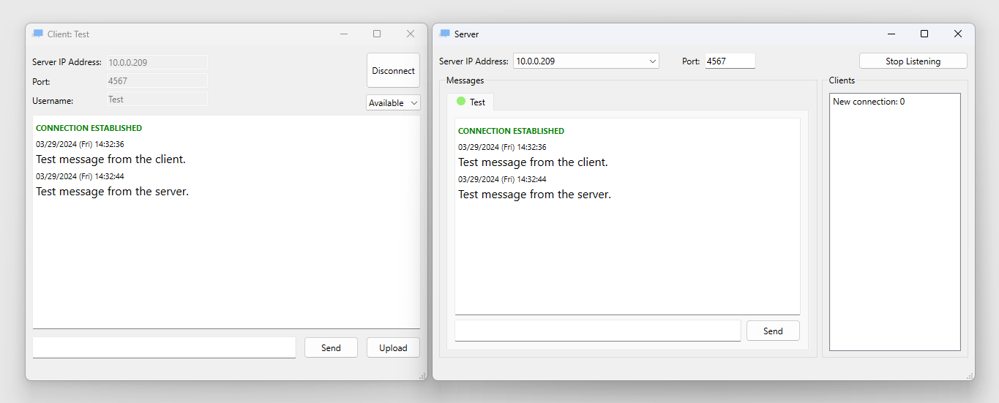

# Earlier Projects

A few small-scale projects I did earlier in my programming journey.

## EVE Online Hacking Game <Badge type="tip" text="python" /><Badge type="tip" text="pygame" /><Badge type="danger" text="early" />

In [EVE Online](https://en.wikipedia.org/wiki/Eve_Online), there is a [hacking game](https://wiki.eveuniversity.org/Hacking), sort of like a "glorified minesweeper". I made a replicate of the game with Python (the only language I knew back then) and pygame. Due to the triangular tessellation, the game requires a lot of graph algorithms, which made it quite challenging for me. The game also involves some object-oriented design.

## Bear Map <Badge type="tip" text="java" /><Badge type="tip" text="backend" /><Badge type="tip" text="DSA" /><Badge type="info" text="school-project" /><Badge type="danger" text="early" />

Project 2 of [CS 61B](https://sp18.datastructur.es/) (2018 Spring). This was an interesting and fun backend project in which we implemented some basic functionalities of a map application, including

- raster mapping (math & geometry)
- XML parsing and graph building (graph representation)
- route searching (dijkstra & A*)
- plain English navigation
- search autocomplete (trie)

I also understood how frontend and backend work together through this project.

## Sticky Notes <Badge type="tip" text="cpp" /><Badge type="tip" text="qt" /><Badge type="tip" text="desktop-application" /><Badge type="danger" text="early" />

I was quite interested in desktop application development before, so I spent some time learning the Qt (C++) framework. This is one of two applications I made with Qt. Both Mac and Windows 11 have a nice sticky notes application, so I made my own Linux version, which worked well on Xfce. It supports rich-text editting, color customization, and it comes with a central panel (similar to Windows 11). It also supports "stay-on-top", which is not supported on Mac and Windows 11.

## LAN Messaging & File Sharing <Badge type="tip" text="cpp" /><Badge type="tip" text="qt" /><Badge type="tip" text="desktop-application" /><Badge type="danger" text="early" />

This is the second application I made with Qt. It implements the client and server of a LAN IM (instant messaging) application. It also supports file sharing. The project involves some very basic network programming.

## Responsive Personal Website <Badge type="tip" text="html-css-js" /><Badge type="danger" text="early" />

This was my first personal website, which I wrote completely from scratch with HTML, CSS, and JavaScript. I learnt many frontend techniques from writing this website, but I soon realized frontend isn't very interesting to me. Since its content is already outdated, I took it offline.
