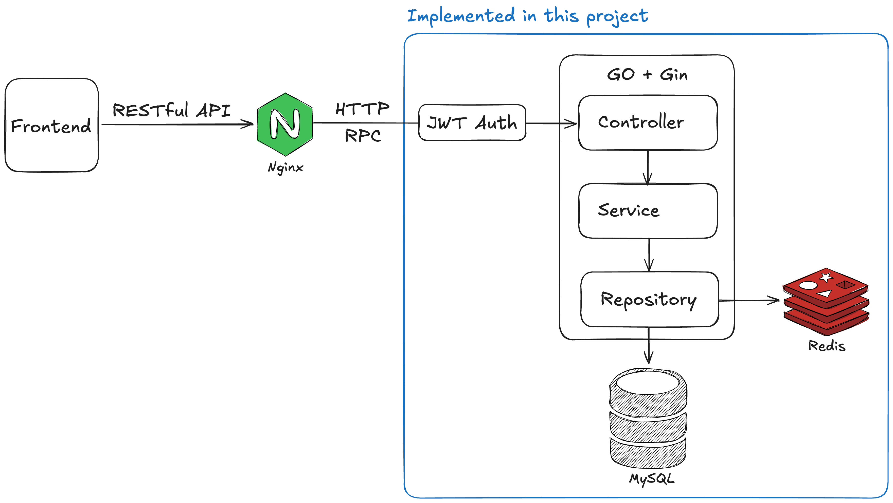

<Badge type="tip" text="go" />
<Badge type="tip" text="gin" />
<Badge type="tip" text="mysql" />
<Badge type="tip" text="redis" />
<Badge type="tip" text="web-development" />
<Badge type="tip" text="backend" />
<Badge type="tip" text="monolith" />
<Badge type="info" text="educational-project" />

# Forum

**GitHub**: https://github.com/soondubu137/go-forum

This _educational_ project demonstrates (monolith) web development with [Go](https://go.dev). This project implements the backend of an online forum.

> [!NOTE]
>
> A frontend is _not_ implemented with this project.

## Introduction

This is a typical forum project. Users can register and publish posts. Each post belongs to a specific community, users can query for a list of posts (paginated) under a specific community.

There is also a voting mechanism. Users can vote up or down on a specific post, and this will affect the "score" of a post. Time also affect the "score" of a post (newer posts have higher scores). When users query for a list of paginated posts, they can specify the sorting order - by newest or by highest score. Scores are stored in Redis for improved performance.

## Project Architecture

This project strictly follows the **CSR (controller-service-repository) layered architecture**.

> [!TIP]
>
> Sometimes "service" is used interchangeably with "logic", and "repository" with "DAO".

Controller: entrance to the underlying service, responsible for handling routes, parameter validation, and redirection.

Service: responsible for handling specific business logic.

Repository: responsible for interacting with the underlying databases.

## Technologies & Tools

- In this project, we use the popular web-development framework [Gin](https://github.com/gin-gonic/gin). The choice of framework is certainly not definitive,

  > Be an engineer, not a frameworker.

- Database: MySQL. In this project, we simply use [sqlx](https://github.com/jmoiron/sqlx) to write pre-compiled SQL statements to do CRUD, although we can also use [GORM](https://github.com/go-gorm/gorm) to simplify CRUD operations.

- Votes caching: Redis.

- Distributed ID generation: [snowflake](https://en.wikipedia.org/wiki/Snowflake_ID) is a popular distributed ID generation algorithm. It ensures global uniqueness and monotonicity.

- Authentication: JWT (JWT generation: [jwt-go](https://github.com/dgrijalva/jwt-go)).

- Logging: [Zap](https://github.com/uber-go/zap).

- Config management: [Viper](https://github.com/spf13/viper).

- API testing: [Bruno](https://github.com/usebruno/bruno).

## Features

- Users

  - JWT

    User authentication is done with single-token JWT (i.e. only authentication token, no refresh token). JWT authentication is implemented as a _middleware_ in Gin, intercepting all auth-required requests. If JWT authentication is successful, the user ID will be injected into the Gin context. See `middleware/auth.go` for details.

  - Salted password hashing

    Password hashing alone is not sufficient due to its susceptibility to [dictionary attack](https://en.wikipedia.org/wiki/Dictionary_attack). Salted password hashing increases the brute-force attack's time complexity from $O(D+n)$ to $O(D\cdot n)$, where $D$ is the dictionary size and $n$ is the number of the compromised password hashes.

- Posts

  - CRUD

    Create a post. Query for a list of posts (paginated) under a specific community. When querying for posts, users can specify the order in which the list of posts are returned. Imagine there is a button on the frontend, you can toggle it between "by newest" and "by hottest". I implemented a simple scoring system for the posts, both voting and time can affect the score of a post, which then affects how "hot" a post is.

- Communities

  - CRUD

    Create a community. Query for a list of communities (paginated).

- Voting

  - There are two `ZSET`s in Redis: `post::time` where KV-pairs contain post ID and creation time, and `post::score` where KV-pairs contain post ID and score. In addition, for each post, there is a `ZSET` keeping track of the voting status. When users create a post or vote for a post, the `ZSET`s are updated accordingly to ensure the scores are always up-to-date. This functionality is implemented with Redis instead of MySQL to improve performance.

- Engineering

  - Graceful shutdown.
  - Centralized response management.
  - Centralized error management.

## Learning Outcomes

Through this project, I

- gained practical experience with Go,
- gained familiarity with MySQL and Redis operations,
- gained familiarity with Gin and other popular web-dev components (zap, viper, etc.),
- gained familiarity with CRS architecture,
- accumulated project design and development experience.

## Extensions

Here I list some potential extensions to this project.

| Extension     | Explanation                                                                                                                                         |
| ------------- | --------------------------------------------------------------------------------------------------------------------------------------------------- |
| Refresh Token | Add a refresh token to JWT authentication.                                                                                                          |
| Post Deletion | Allows users to delete a post. However, this is just more CRUD. If you are already familiar with basic CRUD with sqlx, this task is unenlightening. |
| Comment       | Allows users to post comments on others' posts. This may be slightly more interesting than post deletion, but essentially it is still CRUD.         |

## References

1. This project is based on Wenzhou Li's Go web development course.
2. https://textbook.cs161.org/crypto/passwords.html#148-password-hashing-done-right
