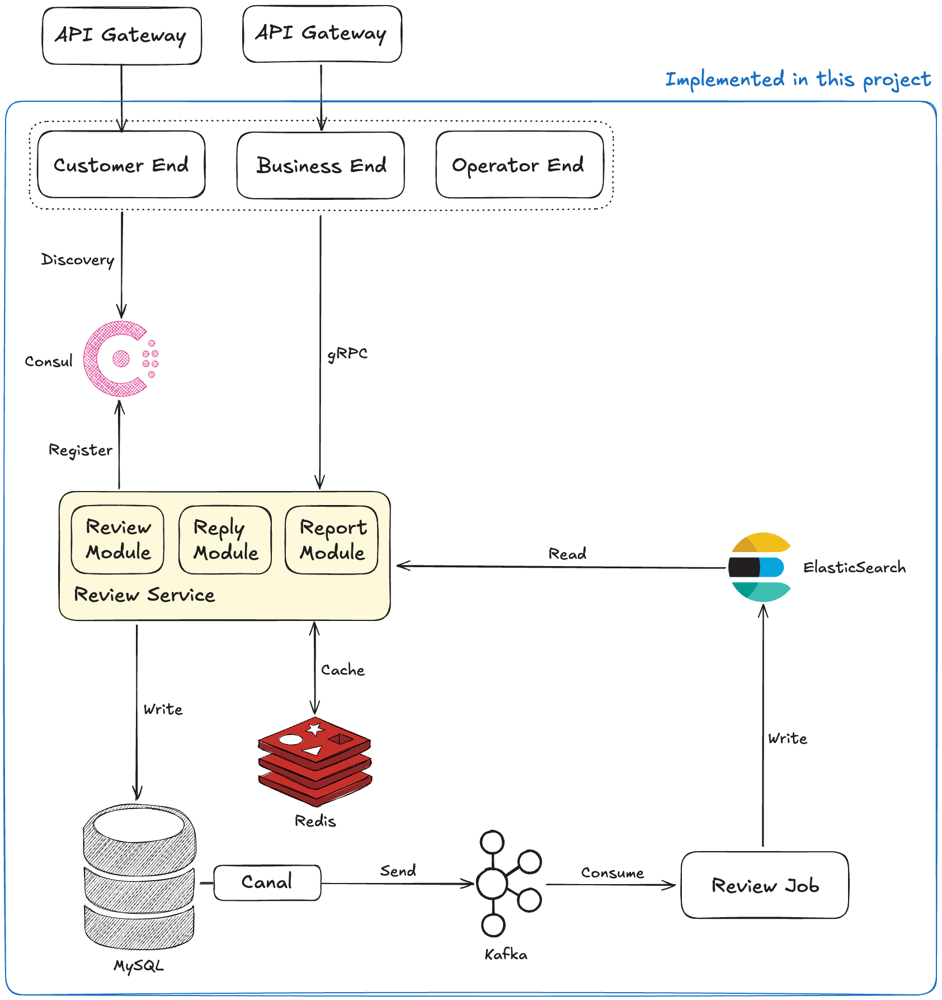

<Badge type="tip" text="go" />
<Badge type="tip" text="go-kratos" />
<Badge type="tip" text="gorm" />
<Badge type="tip" text="grpc" />
<Badge type="tip" text="protobuf" />
<Badge type="tip" text="mysql" />
<Badge type="tip" text="redis" />
<Badge type="tip" text="kafka" />
<Badge type="tip" text="elasticsearch" />
<Badge type="tip" text="microservices" />
<Badge type="info" text="educational-project" />
<Badge type="warning" text="wip" />

# Review System

**GitHub**: https://github.com/soondubu137/go-review-system

This *educational* project implements a basic review system as a microservice in [Go](https://go.dev).

I'm still working on `review-customer`.

## Introduction

A review system is indispensable in virtually every online business platform. After you buy a product from Amazon, you can leave a review for the product; after you take a trip with Uber, you can leave a review for the ride; after you spend a night at a place you booked on AirBnb, you can leave a review for the house...

A review service typically involves three parties: you, the seller (or the driver, the host), and the platform operators. Take Amazon for an example, after you submit a review, your review will be reviewed by the platform operators (to make sure you are leaving relevant comments and being polite), and the sellers can choose to reply to you. The sellers can also report inappropriate reviews regarding their products. Such reports will be reviewed by the platform operators as well.

> [!NOTE]
>
> Of course, users can also report other users' reviews, but we don't implement it in this project since allowing the sellers to report is sufficient for learning purposes.

This project implements a basic version of such a review service.

## Project Architecture

An illustration of the project architecture:



The project contains the following essential components:

- Review service

  Being a stand-alone microservice, the review service contains all the core business logics related to reviews.

- Customer end

  Invoke the review service through gRPC. This component is auxiliary in this project, functionalities irrelevant to reviews are not implemented.

- Business end

  Same as the customer end.

- Operator end

  Same as the customer end.

- Review job

  A process listening to a Kafka message queue and saves data to ElasticSearch.

- Database storing all the reviews and reports and their process status.
- ElasticSearch and Redis.
- A Kafka message broker.

## Run the Project

Make sure you have installed go-kratos, MySQL, Redis, Canal, ElasticSearch, Kafka, and Consul. Docker is the recommended way.

> [!CAUTION]
>
> MySQL version needs to be `8.0.x` and Canal version needs to be `1.1.6` or `1.1.7`.

You can set up Consul easily with the `datacenter-deploy-service-discovery` example in [this repository](https://github.com/hashicorp/learn-consul-docker).

Run the following command to install dependencies:

```bash
make init
```

Before running the project, make sure all the port numbers match. The config file (for each service) is at `/configs/config.yaml`.

Then run with:

```bash
kratos run
```

Check Makefile to see other commands.

ORM generation:

```bash
cd cmd/gen
go run generate.go
```

Dependency injection:

```bash
cd cmd/[service-name]
wire
```

## Technologies & Tools

- In this project, we use [go-kratos](https://github.com/go-kratos/kratos) as the development framework. I personally quite like go-kratos, it provides a very streamlined development experience, albeit being slightly more complex.
- RPC framework: gRPC.
- Type-safe ORM: [GORM Gen](https://github.com/go-gorm/gen).
- Compile-time dependency injection: [Wire](https://github.com/google/wire).
- Database: MySQL.
- Change data capture: [Canal](https://github.com/alibaba/canal).
- Cache: Redis.
- Command query responsibility segregation (CQRS): ElasticSearch.
- Message broker: Apache Kafka.
- Service registry: Consul.
- API testing: [Bruno](https://github.com/usebruno/bruno).

## Features <Badge type="warning" text="wip" />

- Posting a review

  The customer can post a review through the customer end, which will then invoke the review service through gRPC to process the review. The review will be marked as PENDING and stored in the database. Canal will then capture the binlog generated by MySQL and forward it to a Kafka message queue. There is a process (`review-job`) asynchronously consuming binlogs from the MQ and saving the review/report data to ElasticSearch.

- Replying to a review

  The seller can post a reply to a specific review through the business end, which follows a similar procedure.

- Reporting a review

  The seller can, through the business end, report a specific review for a product that is sold by that seller, which follows a similar procedure.

- Processing a review or report

  The platform operator can, through the operator end, invoke the review service through gRPC to query ElasticSearch for pending reviews and reports, then they can approve or decline the request through the operator end.

- Engineering

  - Performance improvement

    The review system is loosely a more-read-less-write system: most of the time customers read others' reviews, and they occasionally write their own reviews. Therefore, adding a Redis cache layer to the review service can greatly improve performance.

    We use singleflight to prevent cache breakdown.

  - RPC

    As typically seen in microservice architecture, we use RPC instead of RESTful API for inter-service communications. We use protobuf encoding.

    ::: info NOTE
    In the project implementation, RPC and RESTful APIs are both enabled. It is easier to test with RESTful API.
    :::

  - CQRS

    When the platform operator queries for pending reviews and reports, it can be very costly it they query the MySQL database directly. Therefore, we segregate command (data manipulation) and query (data reading) with ElasticSearch to make the querying more effective.

  - Message queue

    We use Kafka to decouple MySQL from ElasticSearch and improve reliability.

  - Service registry & service discovery

    We use Consul for this.

## Learning Outcomes

Through this project, I

- gained practical experience with Go,
- gained familiarity with go-kratos,
- gained familiarity with gRPC and protobuf,
- gained familiarity with MySQL, Redis, and basic ElasticSearch operations,
- gained familiarity with microservices architecture,
- accumulated project design and development experience.

## Extensions

Some potential extensions to this project:

| Extension                    | Explanation                                                  |
| ---------------------------- | ------------------------------------------------------------ |
| More Elaborated End Services | Add the usual login/logout functionalities to the end services. |
| Authentication               | Based on the previous point, add user authentication.        |
| User Report                  | Allows users to report reviews or replies as well.           |
| Machine Check Middle Layer   | This would be a cool extension. Implement a simple algorithm to do a pre-check on each review and reply before sending it to the platform operators. |


## References

1. This project is based on Wenzhou Li's microservices course.
2. https://go-kratos.dev/en/
3. https://www.pixelstech.net/article/1586522853-What-is-cache-penetration-cache-breakdown-and-cache-avalanche

