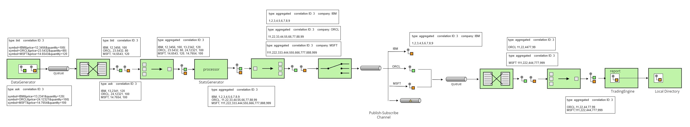

<Badge type="tip" text="java" />
<Badge type="tip" text="design-patterns" />
<Badge type="tip" text="enterprise-integration-patterns" />
<Badge type="tip" text="message-queue" />
<Badge type="info" text="school-project" />

# Integration

Private source code.

::: warning CLARIFICATION
Source code for school projects cannot be public.
:::

## Introduction

This is a smaller-scale project for my object-oriented architecture class at UChicago. This project focuses on object-oriented design patterns, architecture patterns, and [enterprise integration patterns](https://www.enterpriseintegrationpatterns.com/patterns/messaging/toc.html) (EIP).

## Project Architecture

An illustration of the project architecture:

::: info NOTE
The image above may be too small for the text to be legible. Explanations are given below.
:::

The project is simulating the integration of a distributed trading system. There are three main parts:

- Data generator
- Statistics generator
- Trading engine(s)

The data generator simulates an upstream stock information source, it generates simulated stock ticks. The point is that the stock information can be in any format (csv, json, xml, or some random format), and it has to integrate seamlessly into the system.

The statistics generator consumes the stock ticks from the data generator and computes a list of related statistical quantities for each tick. It then needs to rearrange all the statistics and publish them to separate pub-sub topics, one for each company. The statistics generator needs to do a lot of message transformations to ensure the downstream trading engines can receive the correct statistics in the correct format for each company.

The trading engines don't trade (well... that will be too complicated for this project), they subscribe to all the company topics they have business with and update their internal portfolios accordingly. They also generate reports periodically and save them to the local disk.

Different parts of the system communicate asynchronously through message queues.

## Technologies & Tools

This project, focusing on enterprise integration, primarily relies on the open-source integration framework [Apache Camel](https://camel.apache.org/manual/faq/what-is-camel.html). In particular, we use the domain-specific language (DSL) corresponding to Java.

We use [Apache ActiveMQ](https://activemq.apache.org/) for its maturity and simplicity.

The project is based on Apache Maven.

## Design Patterns

- **Singleton**: the report engine in each trading engine is implemented as a singleton.

- **Composite**: the portfolio (containing individual stocks and nested portfolios) is implemented as a composite.

- **Strategy**: the data generator has an *interface* with an abstract function `generateData`, and there are three classes implementing this interface - one for each supported format. This allows data generation with the strategy pattern.

- **Iterator**: iterator is used to traverse all the portfolios.

## Enterprise Integration Patterns

- Event-Driven Consumers.

- Message Translator.

- Aggregator.

- Splitter.

- Publish-Subscribe Channel.

- Content-Based Router.

- Invalid Message Channel.